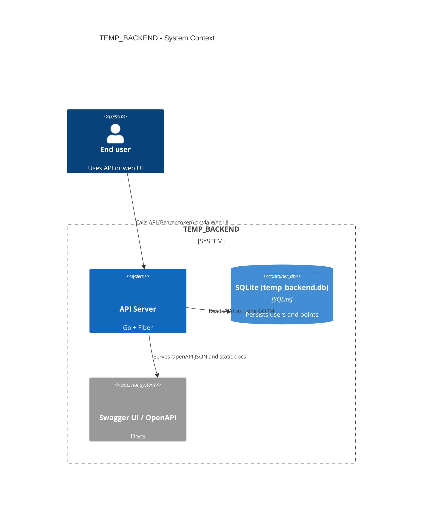
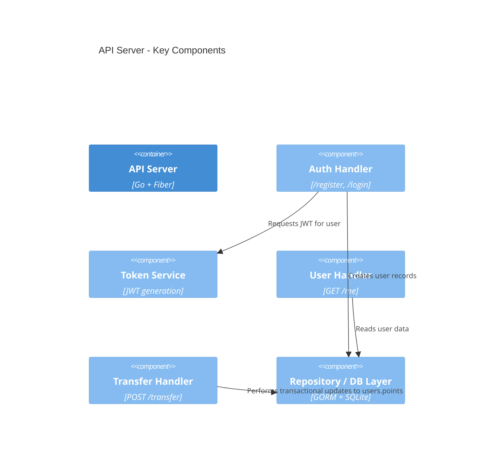

# Architecture — C4 Summary for TEMP_BACKEND (Mermaid C4)

This document summarizes the TEMP_BACKEND architecture using Mermaid's C4 syntax. It includes System Context, Container and Component views derived from the current codebase (`main.go`).

Render instructions

- Mermaid C4 diagrams can be rendered by tools that support Mermaid (VS Code Mermaid preview, GitHub markdown rendering for supported versions, or mermaid-cli).
- To render diagrams to SVG using mermaid-cli (Windows PowerShell):
  - Install: `npm install -g @mermaid-js/mermaid-cli` or use `npx @mermaid-js/mermaid-cli`
  - Extract the Mermaid code block you want to render into a `.mmd` file (for example `docs/system_context.mmd`).
  - Render: `npx @mermaid-js/mermaid-cli -i docs/system_context.mmd -o docs/system_context.svg`
- Alternatively use VS Code Mermaid preview or an online Mermaid renderer.

System Context (Level 1)



Container (Level 2)

```mermaid
%%{init: {"securityLevel": "loose"}}%%
C4Container
title API Server - Containers

Person(user, "End user", "Authenticated user")
System_Ext(swagger, "Swagger UI / OpenAPI", "Docs")

Container(api, "API Server", "Go + Fiber", "Implements auth and points transfer")
ContainerDb(db, "SQLite DB (temp_backend.db)", "SQLite", "Stores users and points")

"""
Define components that run within the API container. Mermaid C4 does not require a Boundary block; components are listed and related to the container and other elements.
"""

Component(authHandler, "Auth Handler", "Handles /register and /login - hashes passwords, creates users, issues JWTs")
Component(userHandler, "User Handler", "Handles /me - returns current user data")
Component(transferHandler, "Transfer Handler", "Handles /transfer - performs transactional points transfer using GORM")
Component(tokenService, "Token Service", "JWT generation/validation - creates signed JWTs using secret")
Component(repo, "Repository (GORM)", "GORM + SQLite", "Data persistence and queries")

Rel(user, api, "Uses REST API (Bearer token)")
Rel(api, db, "Reads/Writes via GORM")
Rel(api, swagger, "Serves OpenAPI JSON and static docs")
Rel(authHandler, tokenService, "Generates JWTs")
Rel(transferHandler, repo, "Reads/Writes users within transaction")
Rel(userHandler, repo, "Reads user record")
```

Component (Level 3)



Environment & .env recommendation

- Do not commit secrets. Move `jwtSecret` into an environment variable (example key: `JWT_SECRET`).
- Example `.env` content (do not commit this file to git):

```text
# .env.example
JWT_SECRET=change_this_to_a_strong_random_value
PORT=3000
```

- In `main.go`, replace the hard-coded `jwtSecret` with reading from environment, e.g.: `jwtSecret := []byte(os.Getenv("JWT_SECRET"))` and document fallback behavior.

Operational notes & recommendations

- Add input validation (email format, password strength) and explicit error responses.
- Replace SQLite with a server-grade DB (Postgres/MySQL) for production and add versioned migrations.
- Add tests for concurrent transfers to validate transactional integrity under load.
- Consider adding a small docs/diagrams folder with pre-rendered SVGs for quick viewing in GitHub.

References

- Mermaid C4: https://mermaid.js.org/syntax/c4.html
- C4 Model examples: https://c4model.com/diagrams/
- Mermaid CLI: https://github.com/mermaid-js/mermaid-cli
