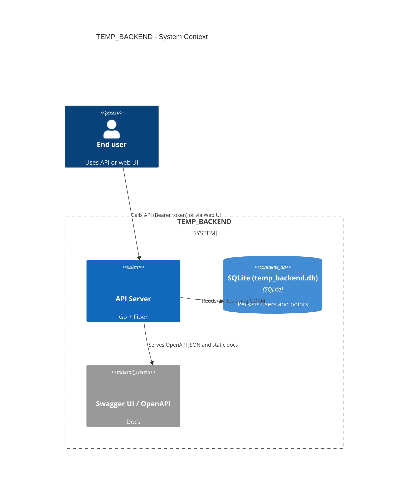
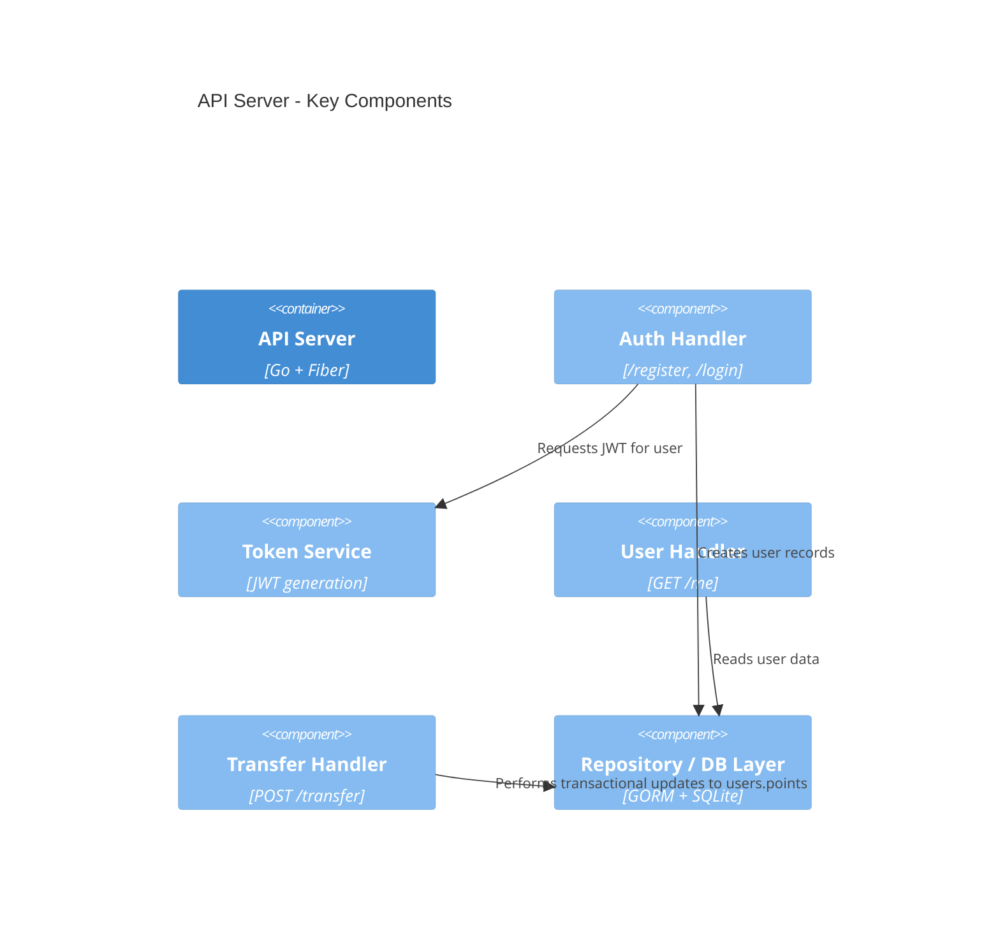

# Architecture — C4 Summary for TEMP_BACKEND (Mermaid C4)

This document summarizes the TEMP_BACKEND architecture using Mermaid's C4 syntax. It includes System Context, Container and Component views derived from the current codebase (`main.go`).

Render instructions

- Mermaid C4 diagrams can be rendered by tools that support Mermaid (VS Code Mermaid preview, GitHub markdown rendering for supported versions, or mermaid-cli).
- Each diagram uses the C4 flavor keywords: C4Context, C4Container, C4Component.

System Context (Level 1)



Container (Level 2)

```mermaid
%%{init: {"securityLevel": "loose"}}%%
C4Container
title API Server - Containers

Person(user, "End user", "Authenticated user")
System_Ext(swagger, "Swagger UI / OpenAPI", "Docs")

Container(api, "API Server", "Go + Fiber", "Implements auth and points transfer")
Container_Db(db, "SQLite DB (temp_backend.db)", "SQLite", "Stores users and points")

Boundary(apiBoundary, api, "API Server") {
  Component(authHandler, "Auth Handler", "Handles /register and /login", "Hashes passwords, creates users, issues JWTs")
  Component(userHandler, "User Handler", "Handles /me", "Returns current user data")
  Component(transferHandler, "Transfer Handler", "Handles /transfer", "Performs transactional points transfer using GORM transaction")
  Component(tokenService, "Token Service", "JWT generation/validation", "Creates signed JWTs using secret")
  Component(repo, "Repository (GORM)", "GORM + SQLite", "Data persistence and queries")
}

Rel(user, api, "Uses REST API (Bearer token)")
Rel(api, db, "Reads/Writes via GORM")
Rel(api, swagger, "Serves OpenAPI JSON and static docs")
Rel(authHandler, tokenService, "Generates JWTs")
Rel(transferHandler, repo, "Reads/Writes users within transaction")
Rel(userHandler, repo, "Reads user record")
```

Component (Level 3)



Operational notes & recommendations

- Move `jwtSecret` into environment variables (for example use `JWT_SECRET`) and do not commit secrets.
- Add input validation (email format, password strength) and explicit error responses.
- Replace SQLite with a server-grade DB (Postgres/MySQL) for production and add versioned migrations.
- Add tests for concurrent transfers to validate transactional integrity under load.

References

- Mermaid C4: https://mermaid.js.org/syntax/c4.html
- C4 Model examples: https://c4model.com/diagrams/
