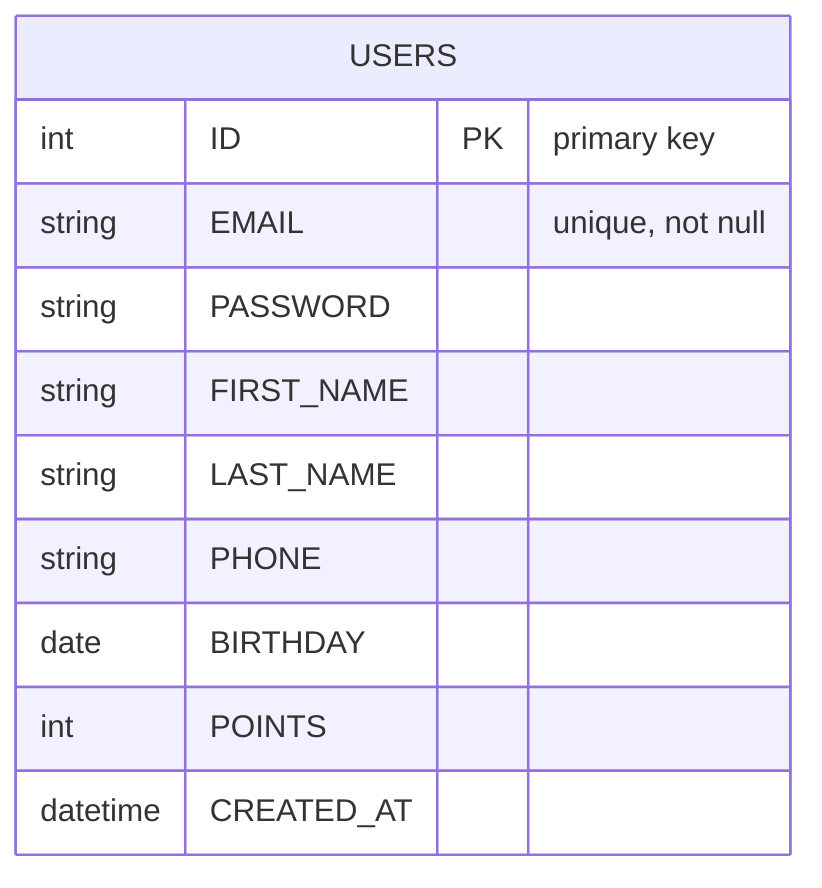

# Database ER diagram

This ER diagram is generated from the `User` model in `main.go` and shows the database table and columns as created by GORM (SQLite).

Notes

- GORM default pluralizes struct names; `User` becomes `users` table.
- The `email` field has a unique index (`gorm:"uniqueIndex"`).
- `temp_backend.db` is created in the project root and GORM auto-migrates the `users` table on startup.
